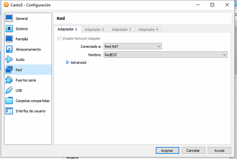

# Crear una Red Virtual en VB #

Noviembre 2022

En esta práctica vamos a crear una red en Virtual Box para conectar en ellas las máquinas con las que vamos a hacer las distintas prácticas.

## Crear la Red ##

Para crear la red, lo primero que vamos a hacer es irnos a preferencias y en el apartado Red crearemos una Red NAT, para conectar las distintas máquinas virtuales.

Configuraremos la red que se llamará REDEOI, la IP de la red será la 192.168.6.0/24 y la máscara de red 255.255.255.0.

Además de esto habilitaremos el DHCP, para que reparta las IP.

Una vez hecho esto tendremos que configurar cada máquina.

### Windows 10 

Para configurar la máquina pulsaremos sobre ella y el boton configuración en el apartado de red estableceremos Red NAT y seleccionaremos nuestra red (REDEOI)

Una vez configurada procederemos a iniciarla, una vez se ha iniciado abriremos una pantalla de comandos y observaremos si se ha hecho correctamente.

Como se  puede observar en la imagen la red se ha configurado de manera correcta, esta en concreto tiene la dirección ip 192.168.6.4, la puerta de enlace es 192.168.6.1, despues de esto hemos hecho ping a una pagina web para comprobar que hay salida a internet y como se puede ver la cpnexión se ealiza de forma satisfactoria.

### Windows Server 2019

 

Para el Windows Server la instalación es igual a la de widows 10.

En esta ocasión vemos que el DHCP ha asignado a esta máquina la dirección 192.168.6.5, tendiendo la misma máscara y puerta de enlace.

Llegado a este punto probamos a hacer ping de una máquina a otra con el siguiente resultado.

Esto se debe a que los cortafuegos de windows los bloquean.

### CentOS

La primera parte de la configuración es igual a las anteriores.

Ahora los siguientes pasos son totalmente diferentes a los anteriores procesos.

Para empezar usaremos el comando ip route para ver la información del adaptador de red.

Podemos ver que el DHCP asigna a esta máquina la dirección 196.168.6.6, con la misma puerta de enlace que las anteriores.

Hacemos ping a la página de Google, obteniendo el siguiente resultado.

Como podemos ver esta máquina tiene salida a internet, probamos a intentar hacer ping a una de las otras máquina y viceversa.

Desde windows 10 vemos que si se puede hacer ping a la máquina CentOS cosa que con el server no podia .

## Diagrama

